# Critique of our Coding Style

## Thoughts on minimum code sharing data standards - using the SIA's social housing repository as an example of the good, the bad and the ugly

The Social Investment Agency's Evidence and Insights (E&I) team consists of 9 people who regularly write code for an ever growing set of reusable tools. Writing code is one thing, but when you have to make sure the rest of the team can follow it, it runs error free, and is easy to debug - that is an entirely different kettle of fish. That's where coding standards come in.

Until recently, the team's coding standards remained in the heads of individual team members. The team has taken some time to discuss and commit these [standards](https://nz-social-investment-agency.github.io/sia_analytical_processes/output/siu_coding_style_guide_v1.0.html) to paper (or, should I say, to `html`).

Some of our GitHub repositories were developed prior to the standards being published so we thought it would be a good idea to review one of these to see what was done well and what could be improved upon. The repository that contains the code used in our [social housing analysis](https://github.com/nz-social-investment-agency/social_housing) was chosen for review.

### There are things we did well with the social housing code

#### Version control allows for tracking changes, effectively versioning code and collaborating with others
Storing code in an online repository like GitHub means that anyone can see it. The social housing code is in its infancy meaning it has not had many collaborators or versions. When it grows bigger it might start to look something like the [Social Investment Anlaytical Layer](https://github.com/nz-social-investment-agency/social_investment_analytical_layer) repository which has many commits and multiple contributors.

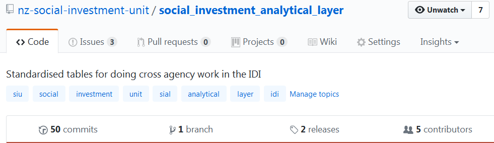

By using GitHub, bugs in code can easily be raised using the `issues` functionality. There is also the ability for users to see exactly what changes have been made with every commit and which contributors made them. 

#### READMEs are the first place to look for information about a repository and how to run the code

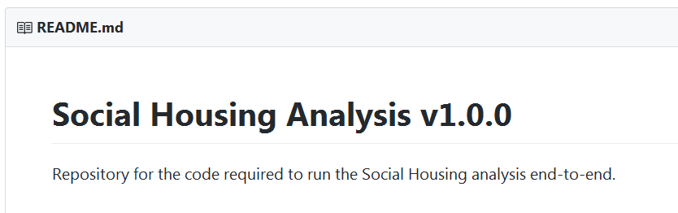

The social housing repository has step by step instructions in the `README` for how to run the code. This means that any person wanting to use the code is able understand what it is for and how to run it.

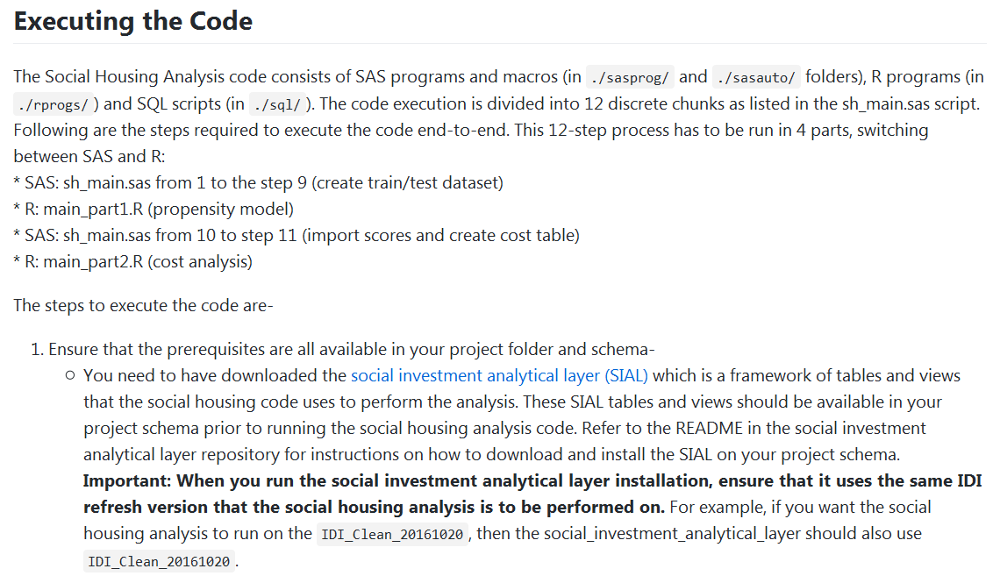

#### Using parameters means that anyone can run the code
We share our code with the intention that people outside the SIA are be able to run it with ease. With this in mind the important variables in the social housing code have been parameterised.

File paths are made to be relative by making use of macro variables `sasdir` and `sasdirgen`. This means that there are only two file paths that need to be specified. These are at the top of the script where they can clearly be seen. Once a user has specified them they don't need to worry about getting `Access Denied` errors when they try to access a file directory they don't have access to.

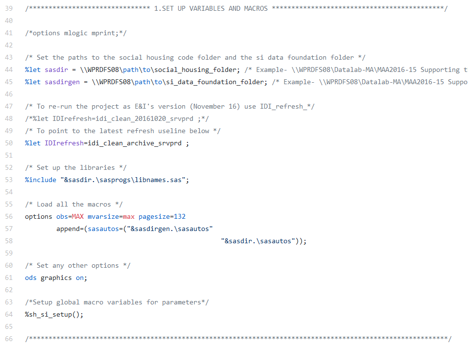

The large of macro variables may look like overkill but this ensures that all macros can be reused again and again rather than having to write similar-looking but slightly different scripts each time.

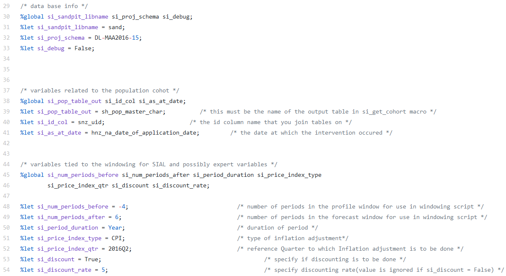

#### Being modular means that the code can be reused across multiple projects
The SIA has created code in such a way that enables easy reuse across projects. This reduces the number of components that need to be created for each project.

The social housing code makes use of reusable code pieces from the [Social Investment Data Foundation repository](https://github.com/nz-social-investment-agency/social_investment_data_foundation) (SIDF). Instead of rewriting the code, the SIDF is read in as a dependency and then the macros are called.

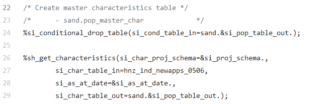

**Tip for power users:** Git allows for sub-modules which can be used to handle dependencies with other products/tools. 

### There are things that could be improved with the social housing code

#### Headers are a great way to explain a script but it's important to have the right detail in them and that they are complete
Each of the social housing scripts clearly denotes its purpose and the inputs and outputs which makes it easy for others to follow and troubleshoot. However, some headers are not complete and there are a small number of scripts that are missing headers altogether.

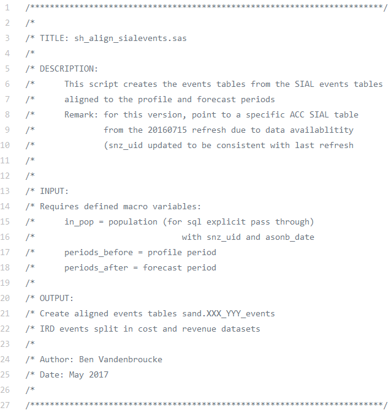

Headers should ideally have a `dependencies` section so it is clear what each script depends on. 

Notes and issues with the code should also be raised in the header so that users have all the key information. The original E&I headers had most of this information but, with staff turnover, some people were not aware of this. This highlights the need for standard header templates.

Our newly-published [standardised headers](https://nz-social-investment-agency.github.io/sia_analytical_processes/output/siu_coding_style_guide_v1.0.html#standardised_headers) are available on GitHub.

#### The folder structure should be intuitive and only necessary files should be in the repository
Originally the repository didn't contain a `docs` folder. We can tell this because GitHub keeps a history of all changes and we can see that the documentation was sitting in the top level of the repository.

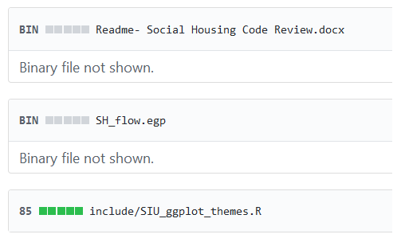

This was spotted, a `docs` folder was created and the documentation was shifted into that folder.

There are also cached image files in the repository that should not be there and need to be deleted.

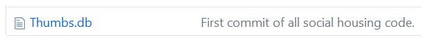

If the folder structure initially requires an empty folder then we put a dummy README.md (or other text file) in it to ensure the folder ends up in the repository.

#### SAS EG projects are not reusable 
The SIA have decided not to use SAS EG projects. The code that we write is designed to be modular and reused. All reusable code is written as macros or functions and sourced via a `sasautos` call for **SAS** and a `source()` for **R**.

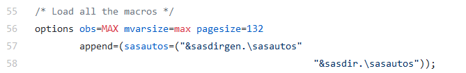

Using `sasautos` requires one macro per script and the macro name must match the file name. The SIA uses dozens of macros and this is the most efficient way to load them all.

We use a `main` script to guide the flow of the code rather than using a SAS EG project. This script includes all the SAS programs and all the macro calls.

The social housing repository did initially have a SAS EG project which has now been removed.

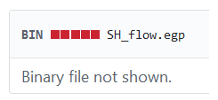

#### File names should not have spaces and should not be ordered by ASCII characters
Spaces in file names should be avoided. These have previously been mistaken as separators in the command line and scripts which then need to be escaped properly. Instead it is much easier to use underscores instead of spaces.

Another problem with the social housing script names is that they are prefixed with numbers.

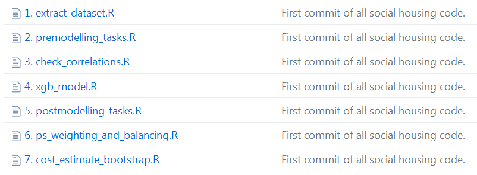

There was a situation in the past where we had to rename scripts because we added a new script that needed to go in between two others. There has also been code where, for example, script number 2 needed to be run at the beginning, followed by script 0 and part of script 1 and the rest of script 2. This becomes too hard to follow.

Our script orders are dictated by the main script not by their ASCII names. Since there is a main script and the scripts are sourced in order, numbering becomes redundant.

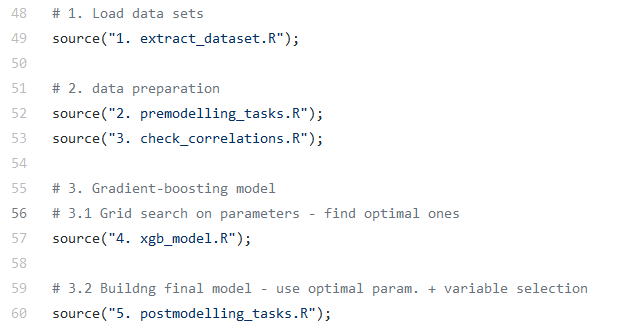

It is a lot easier to reshuffle the scripts in the main script as opposed to renaming all the scripts.

#### Unit tests help ensure code is robust and easier to troubleshoot
No units tests are available for the social housing project. Unit tests are great for checking how a macro runs and when code might need troubleshooting. Starting a new SAS session and reading in all macros with a `sasautos` call gives a clean slate for running unit tests. Recently, for important pieces of code that are going to be reused a lot, unit tests have been incorporated. An example of [unit testing](https://github.com/nz-social-investment-agency/social_investment_data_foundation/blob/master/unittests/si_unit_test.sas) is available on GitHub.

#### Optimising the code ensures better performance
The social housing code has not been fully optimised. Tuning the code could help reduce the amount of time needed to run it and/or the amount of memory consumed. Currently, our coding guidelines require our population tables to be pushed into the database so that in-database processing can be used. Our small population datasets are left joined to the large administrative tables in the database which means only a small joined table is transferred to SAS. This reduces the amount of I/O required.

### The social housing repository had good features that enabled code sharing but there are things that could be improved to ensure it meets a minimum code sharing standard

#### The good

* Using GitHub as a version control tool.
* Including a README with step by step instructions.
* Parameterising key variables and using relative paths means that anyone can reuse the code.
* The code is modular meaning that the code can be reused in projects over and over again.
* Having a `main` script also means that we can do testing to ensure that code runs end to end using just one script. This makes it a lot easier for anyone new picking up the code.

#### The bad

* Scripts should have headers that include all the key information such as inputs, outputs, dependencies and histories. Our new [standardised headers](https://nz-social-investment-agency.github.io/sia_analytical_processes/output/siu_coding_style_guide_v1.0.html#standardised_headers) are available on GitHub.
* The folder structure needs to be intuitive and contain only necessary files. We now actively think about the folder structure during the design phase prior to doing any coding.
* The code could be fully optimised for performance to improve processing time or memory usage. Currently, it is only partially optimised.

#### The ugly

* SAS EG projects do not help with reusability. Our code is modular and reusable by placing each macro in its own script with the file name matching the macro name and sourcing them all via a `sasautos` call. There is no need for SAS EG projects.
* One of the SIA's coding conventions involves appropriate naming of file scripts. We avoid spaces in file names because they can cause problems in the command line and are annoying to escape. We also avoid numbering the scripts. Instead the order of execution is dictated by a `main` script. That way if we need to add a new script in the middle we don't need to rename it. 

### So what do you think? Do you agree with the minimum viable product code sharing standards we have published? If you have anything to share please let us know. 
 
 

