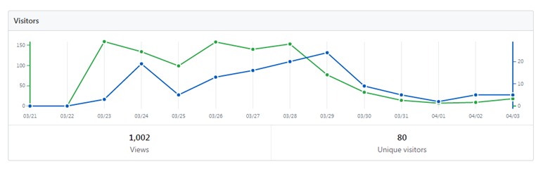
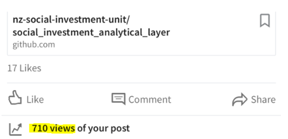

# Value generated from sharing the SIAL code

# The SIAL
The SIA has created a Social Investment Analytical Layer (SIAL): events-structured tables that arrange a version of the data held in Statistics New Zealand's Integrated Data Infrastructure (IDI) into a consistent format. The SIA did this to make it easier and faster for them and authorised IDI users (researchers and analysts) to carry out a piece of cross sector analysis in the IDI. 

This write up looks at the impact the SIAL has had on analysts using the IDI by looking at the awareness, utilisation and collaboration that has resulted from creating and publishing the code used to build the SIAL.

## Publishing the SIAL code on GitHub created more awareness of its existence

On Friday the 24th of March 2017 the SIAL was made publicly available on Github. Github is an online code sharing platform that allows you to track how many visitors the SIAL has had among other things.

In two weeks there were over 1000 page views and 80 unique people who had visited the SIAL code repository.

The web link to the SIAL code was also shared on social media. One SIA team member alone has had over 700 views of their SIAL post.

## Other organisations started using the SIAL code for their analysis
The current IDI setup allows us to see who else is storing the SIAL tables in their project. This allows us to measure usage of the SIAL. At April 2017, three organisations were using the SIAL. At the time of writing this article there were 6 other organisations that had created SIAL tables. The number of organisations using the SIAL is probably an underestimate because Stats NZ have since productionised the SIAL, creating physical tables that users can query. We do not have the statistics on these production tables.

It is clear that time and effort to perform an analysis has decreased because of the SIAL. Having cross agency standardised tables saved considerable time because individuals no longer need to be experts in multiple agencies' datasets. It also saved considerable time in terms of tidying up the code to produce a picture of a person's interaction with Government agencies. By using several of the SIA's reusable tools that are publicly available on GitHub we were able to turn around an urgent piece of work in the space of days rather than months.

In addition there are also cost benefits. It took six SIA members (both a mix of contractors and fixed term staff) six weeks to produce the initial version of the SIAL. This would be 6 people x 40 hours x 6 weeks x $100 an hour = $240,000 in time saved for each team that uses the SIAL. This is a conservative estimate given that contractors are often working in the IDI; the SIA team had considerable experience across a wide range of agency datasets and the SIA team consists of data scientists who are very proficient in SQL coding.

## There are others collaborating with the SIA to improve the SIAL
The SIAL code is undergoing a business review from all the relevant agencies. To date we have received full feedback from MOJ, ACC, MSD, Oranga Tamariki, Police and Corrections. The Ministry of Justice even took the time to write new parts of code to derive court case costs in a more accurate fashion. There are reviews in progress with MOH, MOE, IRD and HNZ.

Further, people outside the SIA have been helping with the development of the SIAL. The Ministry of Justice provided us with a better way of deriving education events that was recommended by MOE. This was reintegrated back into the SIAL.

Stats NZ have gone a step further and taken the SIAL code and used it to create physical tables in the IDI. This will save people time running the code. The SIA may still update the code on GitHub if they require immediate changes to the code for the work they are doing. IDI analysts are free to use the physical tables in the IDI or to download the code which would have the latest enhancements and bug fixes.

## The SIAL is a great example of how sharing open source code can create awareness, utilisation and collaboration
In a short space of time we can see that six other organisations had used the SIAL which has resulted in over a million dollars in savings in terms of organisational costs. Several agencies have completed the business QA and even provided code to help make the SIAL even better.

Last updated Nov-2017 by EW

