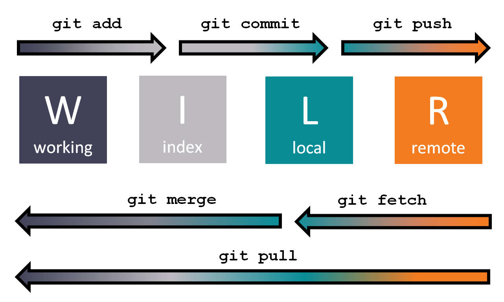
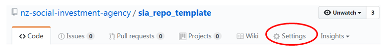
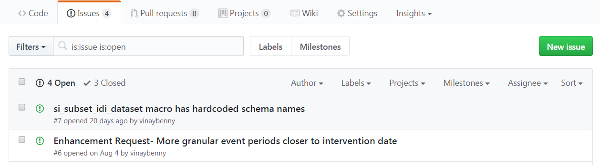
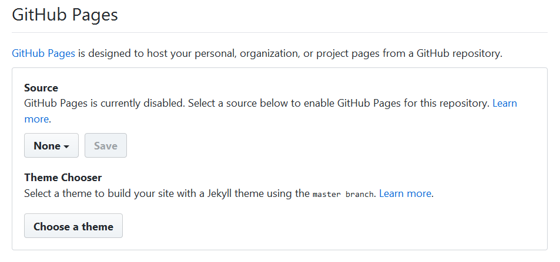

# Topics
Version control allows for a team to collaborate on code without overwriting changes and allows people to track how the code evolved. It makes it very easy to create and move between different versions of your code.

One of the reasons we chose Git as our version control system because it is decentralised. This means that it treats each person's copy as their own repository where they can track changes before sharing the code more widely with the team. It also tracks changes in content rather than files so it takes up a lot less space compared to some other version control tools.

We use GitHub as the hosting service for our Git repositories. GitHub is one of the more popular, widely known public hosting services. While repositories are public by default, they can also be made private if required.

This document outlines how the SIA use Git and shows a few illustrative examples. It could potentially be useful to other organisations so it is available on our Github page. Note that because it is specifically geared towards how the SIA do version control some of the information specific to SIA such as proxies and port numbers are hidden in our document management system. You will not be able to open the file references.

## The Basics

### Setting up Git on your machine
If Git is not readily available or there were issues installing it that are yet to be resolved then it can be installed manually using the following steps.

1.	Go to the [webpage](https://git-scm.com/download/win) where you can download Git.
2.	Download 32 bit build (for now - hopefully the 64 bit laptops will come soon).
3.	Run the executable to run the setup wizard.
4.	Within the setup wizard, do the following:
      *    On the information screen, click next.
      *    On the components screen, leave the default components selected and click next.
      *    On the path environment screen, select use Git from Bash only before clicking next.
      *    On the backend screen, select open ssl library and click next.
      *    On the conventions screen, select windows style commit unix style line endings and click next (this is because we may work on cross platform projects).
      *    On the emulator screen, select MinTTY as a terminal emulator and click next.
      *    On the extra options screen, enable caching and enable the Git credential manager before clicking install.

5.    Open Git Bash and run the following commands can be run **without** replacing the items in the angled brackets.
```{r git_config_proxies, engine='bash',eval=FALSE}
git config --global http.proxy http://<user_name>:<password>@<proxy_server>:<port_number>
git config --global https.proxy https://<user_name>:<password>@<proxy_server>:<port_number>

```

6.    Open the `gitconfig` file. It can be found either in the installation folder (C:\\Program Files\\Git\\etc\\) or within your documents folder (C:\\Users\\\<username\>). It can be edited with a text editor, such as Notepad. You should see the two commands that you typed in step 5.

7.    Enter your work `username` and `password`, replacing the `<user_name>` and `<password>` text already in this file. Note that you need to enter these details in both locations. If your password has special symbols refer to this [website](https://www.w3schools.com/tags/ref_urlencode.asp) for the appropriate percent encoding. For example the password !qwerty123 would be specified as %21qwerty123 in the proxy.

8. Specify the `proxy server` and the `port number`, replacing the `<proxy_server>` and `<port_number>` text already in the file. Be sure to enter these details in both locations. If you do not know what these are you can find them in `A9977164`.

**Do not** type your details (particularly your password) in directly via the terminal in step 5. Your password will be retained in the history for everyone who uses the machine to see.

9. Next, you can add a Git user name and email in the config file. This makes it easier to see who has made commits on GitHub.

```{r git_config_globals, engine='bash',eval=FALSE}
git config --global user.name "Your Name"
git config --global user.email <firstname>.<lastname>@sia.govt.nz
```


**Note:** There was talk of getting a machine that was separate from the network so that individual team members could maintain it and install all the necessary data science tools themselves. If it has a Linux distro installed then steps 1 to 4 would be replaced by:

```{r git_linux_install, engine='bash',eval=FALSE}
sudo apt-get update
sudo apt-get install build-essential libssl-dev libcurl4-gnutls-dev libexpat1-dev gettext unzip
sudo apt-get install git
```

Then follow steps 5 to 9 as given above. Note that the location of the config file will probably be in `/home/`.

### Git workflow
The workflow is represented below. The working area is where you will create new files and make changes to them. For SIA this is on the C drive. When you are ready you can add them to a staging area known as the index which keeps track of all the changes made. Once your are happy you can commit this to the local repository. When you are ready to share with everyone you can push the changes through to the remote repository.

Before making changes it is always a good idea to check you have the latest remote copy. You can pull this straight to your working area or you can fetch it so that it is in your local repository. From there you can check all the changes before merging it with your working copy.

<div class="jumbotron">


</div>

A very good interactive Git cheat-sheet detailing all the different commands can be found [here](http://ndpsoftware.com/git-cheatsheet.html).

### Setting up a new repository
A repository is the structure that holds all our code. The general rule we have is one repository per main script. The exception to this is when we do a project that involves analysing a topic in the IDI. The data extraction is done in SQL, the data wrangling is done in SAS and the analysis is done in R. Since proc iml is not set up in the IDI it makes it difficult to have a single main script.

It is easiest to set up a new repository via the GitHub website rather than the command line

<div class="jumbotron">


</div>

1. On the Social Investment Agency page, click the `New` button.
2. Give the repository a name. It should be short, lower case and separated by underscores (e.g. sia_analytical_processes).
3. Specify a sentence to describe the repository.
4. Ensure the repository is set to private (the manager must give the green light before a repository is made public).
5. Check the "initialise with a README" box
6. Add a license. We use `GNU GPL v3.0` for our code because we want this work and derivatives to be available under the same open license. Justification for this can be found in our document management system in the file `A9536265`. This document was informed partly by [choosealicense.com](https://choosealicense.com/), [NZGOAL2](https://www.ict.govt.nz/guidance-and-resources/open-government/new-zealand-government-open-access-and-licensing-nzgoal-framework/nzgoal2/) and information on the [Creative Commons website](https://creativecommons.org/faq/#can-i-apply-a-creative-commons-license-to-software).


### Cloning a repository
Cloning is a Git command that takes a repository from the remote repository (i.e. from GitHub) and creates a local copy on your machine. You can then make changes and subsequently push them back to the remote repository.

Within Bash, begin by changing directory to your desired working location (e.g. `cd C:/NotBackedUp`). Then enter the following command, specifying the name of the desired Git repository (social_investment_data_foundation.git in the example code below).

```{r git_cloning, engine='bash',eval=FALSE}
# the --recursive option ensure that all dependent repositories are also cloned
# see the submodule section for more information about this
git clone --recursive https://github.com/nz-social-investment-agency/social_investment_data_foundation.git
```

### Pushing your changes to GitHub
To push your changes through to the remote repository it helps to refer to the section called [Git workflow](#git-workflow).

For those who are familiar with other version control tools like subversion, the most common mistake is forgetting to add the files to the index. Make sure you add the files you want to commit before you commit the files.

Again, begin by changing directory to your desired working location within Bash. Then enter the following code.

```{r git_commit, engine='bash', eval=FALSE}
# display changes to the files and items that have not been tracked 
git status
# add modified and new files to the index
# note the . includes all files that were listed in status
git add .
# commit all changed files except untracked files to the local repository
# the -m allows a message to explain the changes that were made
# this should be specified in every commit
git commit -m "skeleton structure"
# push things through to the remote repository
git push origin master
```

### Tagging your repository
Tags are references that point to a particular commit. Our tags are named using [semantic versioning](http://semver.org/). We chose to use annotated tags because they allow for messages, dates and authors to be specified.

**Do not use lightweight tags** (tags without options) because they only contain the SHA number.

Signed tags could be used to check that the tag was created by an authorised person. At this point in time it is probably not required.
```{r git_tags, eval=FALSE}
# the -a option creates an annotated tag
git tag -a v1.1.0 -m "v1.1.0"
# use the --tags option to push the tag to the remote repository
git push --tags origin master
```

Below is a list of tags for one of the repositories.
```{r git_display_tags, eval=FALSE}
git tag -l -n10
v1.0.0          v1.0.0
# looks like someone didnt specify a message with this tag
v1.1.0
v1.1.1          v1.1.1
```


### Switching a repository from private to public
A publicly available repository means anyone with an internet connection can see the repository. Only the person who created the repo or the owner of the organisation can modify the settings of a repository. **Before** making a repository public you must have sign off from the appropriate manager. Full instructions on how to publish code can be found [here](https://github.com/nz-social-investment-agency/sia_analytical_processes/wiki/How-to-Publish-Code).

<div class="jumbotron">


</div>

1. In GitHub click on the repository name.
2. Click on the `Settings` tab.
3. Scroll down to `Danger Zone`.
4. Click on "make this repository public".
5. Type the repository name in the box and click the button below.


## The more challenging tasks

### Dealing with repository dependencies (submodules)
Submodules are a way of incorporating code from another repository. They are very handy because as the external repository gets updated you can also update the code in your submodule. It saves having to create multiple copies of code that all require manual updating.
```{r git_submodules, eval=FALSE}
# make sure you are in your working directory
cd sia_repo_template
# add the dependent repository as a submodule and specify what folder to put the dependent repository in
git submodule add https://github.com/nz-social-investment-agency/social_investment_analytical_layer lib/social_investment_analytical_layer
# confirm that the submodule has been added
git submodule status
# check the status of the working directory
git status
# commit the submodule with an appropriate message
git commit -m 'added sial submodule to lib'
# push the submodule into the remote repository
git push origin master
```

### Closing issues with commit messages
Issues are a way of tracking tasks,bugs and requested enhancements.
<div class="jumbotron">


</div>
Issues can be automatically closed via the commit by using a key word and an issue number.

Key words include: close, closes, closed, fix, fixes, fixed, resolve, resolves and resolved.

An example is shown from the log that would have automatically closed an issue

```{r git_close_issue, engine='bash', eval=FALSE}
# notice the keyword 'fix', a space, the hash and then the issue number
git log --oneline
86eeddb issue fix #1 readme doesnt contain expected output

```

### Retrospectively adding a tag
If code has been pushed to the remote repository and we realise several commits later that we forgot to tag an earlier commit it can be retrospectively added. An example is shown below. It requires knowing the SHA number of the commit you want to tag. This can be retrieved from the logs or from the repo on GitHub.

```{r git_retro_tag, eval=FALSE}
# make sure you are in the working directory
cd social_investment_analytical_layer/
# identify the SHA number of the commit you need
git log --oneline
# strip the date this was committed out of the
"$(git show 8e2045e --format=%aD | head -1)" git log --oneline
# this puts you in detached head state
# you will be sitting in an older commit that needs the tag
git checkout 8e2045e
# manually set the tag date to the date it was committed
GIT_COMMITTER_DATE="$(git show --format=%aD | head -1)" git tag -a v1.0.0 -m "v1.0.0"
# the --tags option ensures that the tags are pushed through
git push --tags origin master
# jump back into the master version
git checkout master
# confirm the tag is there with the right date
git log --oneline
# remove the hard coded date so subsequent commits display the current dates
unset GIT_COMMITTER_DATE
```

### Renaming files
Going to the file explorer and renaming a file will mean Git will treat the original file as deleted and the renamed file as a new file. This can be problematic because it creates a break in the history of the file rather than noting the file has been renamed. This can be avoided by using the following commands

```{r git_mv, engine='bash', eval=FALSE}
# this will note that the file has been renamed rather than believing the original file has been deleted and treating the renamed file as new
git mv SIAL_data_dictionary_JAN_2017.xlsx SIAL_data_dictionary_MAY_2017.xlsx
# use this to confirm that the file has been renamed rather than deleted and added
git status
```

### Publishing markdown with GitHub Pages
GitHub Pages is a site hosting service which can display any HTML file nicely. It is particularly useful for displaying markdown files that have been rendered in HTML.

<div class="jumbotron">


</div>

1. Under `Settings` scroll down to the GitHub Pages section.
2. Select `master branch` (alternatively gh_pages).
3. Click `Save`.
4. Go to the `README` to add a hyperlink to the relevant pages. If there is enough content you may wish to create an index.html so that you have a nicer looking home page.
5. The hyperlink is similar to paths in the repository. The only thing is the organisation / profile should have `.github.io` after it. An example of a GitHub page hyper link is 
`https://nz-social-investment-agency.github.io/sia_analytical_processes/output/coding_style_critique.html`


### Compliance with Legislation
Information on GitHub is collected, stored and processed in the United States.To ensure that we still have access to all our repositories in the unlikely event that GitHub closes we periodically download zip files from GitHub and store them in our information management system.

```{r git_archiving, engine='bash', eval=FALSE}
git clone https://github.com/nz-social-investment-agency/outcomes-measurement.git
git clone https://github.com/nz-social-investment-agency/outcomes-measurement.wiki.git
```

The resulting folders are then zipped and stored in the folder `qA537714`. These should be updated at least every year.

### Troubleshooting - cannot connect
If you try to clone or push changes to the remote repository and it does not work check the following

* Is the repository name correct? The easiest thing to do is go to the GitHub website find the repository and copy and paste the URL.
* Have you spelled the http proxy and https proxy correctly in the `gitconfig` file?
* Have you recently changed your log in/password? If so, make sure you update your `gitconfig` file.
* Has the proxy resolved the domain? If you browse to the site using Chrome (or any other browser) this will force the proxy to resolve the domain. From there you should be able to push changes to master.


### Branching and Merging
Branching creates a separate versioning line that will not muck up the production line (master). This can be used to create fixes before combining (merging) them with the master line, add new enhancements before merging them back to master and so on.

We need to test our code and sign it out of the IDI before we can push it through to master. Effectively our branching is done manually in the IDI because currently there are no versioning tools in the IDI. Pushing our signed out changes to the remote repository is effectively our version of merging.

For more information on how to do proper branching and merging in Git [click here](https://git-scm.com/book/en/v2/Git-Branching-Basic-Branching-and-Merging).


### Hooks
Hooks are little scripts that are triggered during an event like `commit` or `push`. The most useful hook for the SIA would probably be one that enforces coding standards. Such a hook has not been implemented yet.

An example of a coding standard hook can be found [here](https://gist.github.com/danielpopdan/990f9521f84d693ccd1a).

### Deleting files and purging the history
If you have put sensitive documents in the remote repository or files that shouldn't be in the repository such as oversized datasets then deleting them will mean that they still can be accessed via the history of the repository. To truly remove a file you need to purge the repository's history. This can be done by using the `git filter-branch` command.

```{r git_purging, engine='bash', eval=FALSE}
# make sure you are sitting in the repository
cd /c/NotBackedUp/sia_analytical_processes

# this removes the files
# if the commit only commited that file then you will have an empty commit which will be removed
# this will also remove the file from the tagged releases
# allow a few seconds for the history to be rewritten
git filter-branch --force --index-filter 'git rm --cached --ignore-unmatch  resources/wrong file.txt' --prune-empty --tag-name-filter cat -- --all

# put the file in the .gitignore so you don't accidentally put it in the repository again
echo "resources/wrong_file.txt" >> .gitignore

# commit these changes to the local repository
git add .gitignore
git commit -m "added files to gitignore"

# once the local repo is tidied up you can overwrite the remote repo
git push origin --force --all
git push origin --force --tags

```
You can then go to GitHub and have a look at the history. You wont be able to find the purged file.

Note that all branches should be rebased and not merged otherwise the bad file could sneak back into the repo.

## Related documents
* Adding an individual to the [SIA GitHub organisation](https://github.com/nz-social-investment-agency/sia_analytical_processes/wiki/Adding-a-person-to-an-IDI-Project) 
* [SIA coding conventions](https://github.com/nz-social-investment-agency/sia_analytical_processes)


Last updated Aug-2018 by EW, SA and CM


