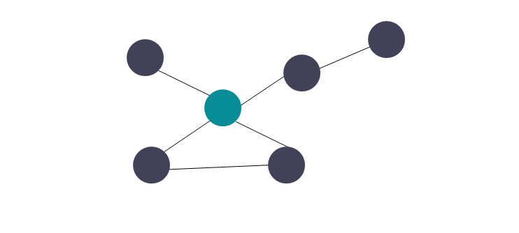
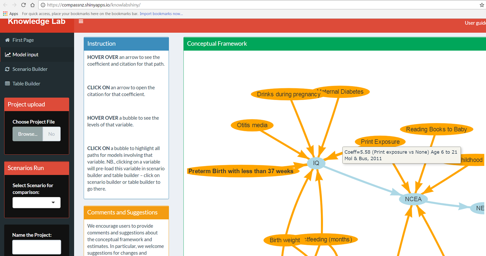
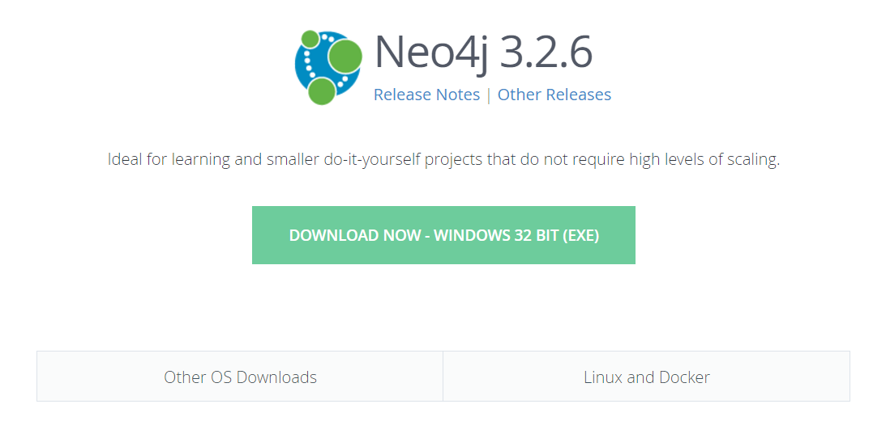
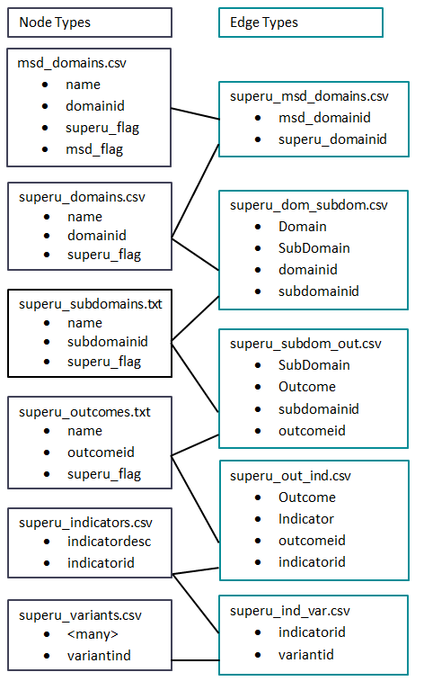
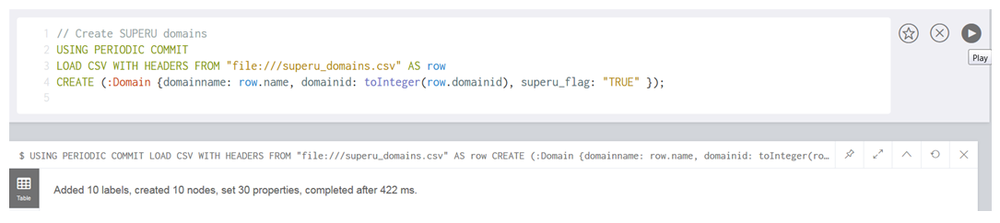
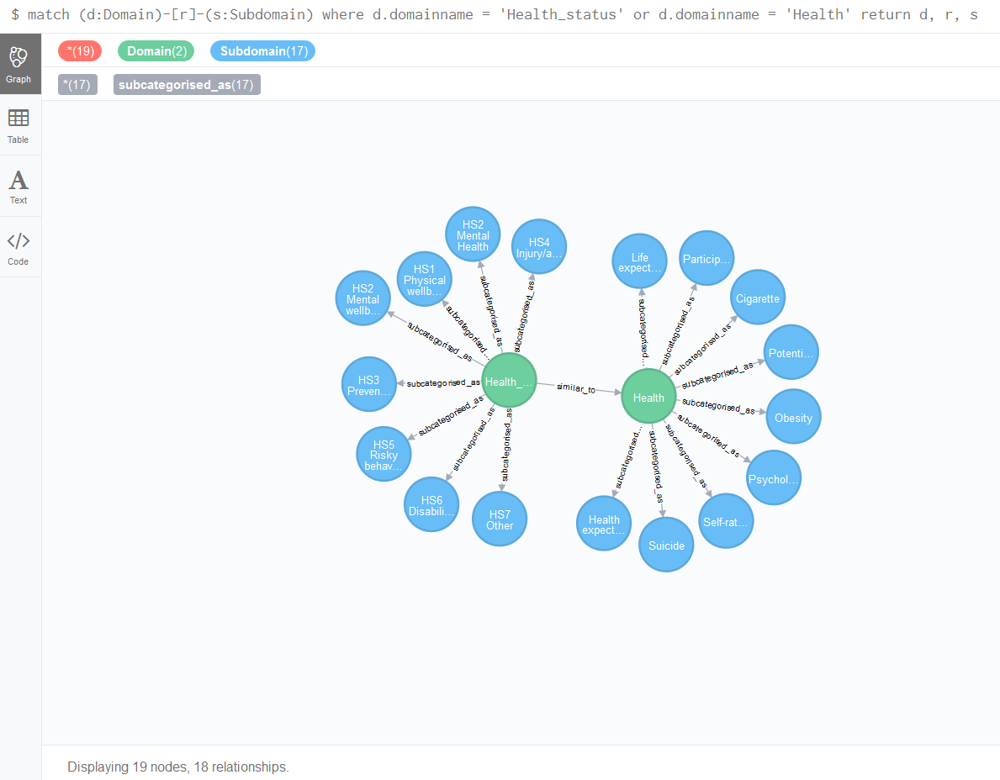
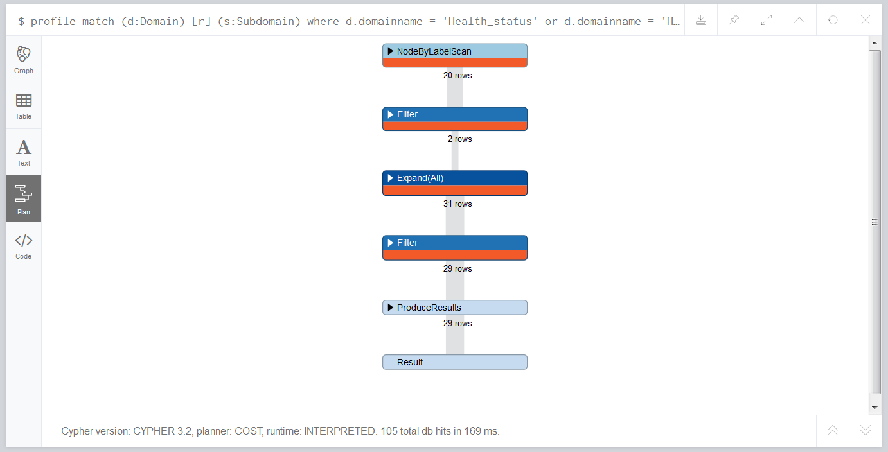

# Topics

## What are graphs?
Graphs are a type of structure used to understand the relationships between a set of objects. A graph is made up of a series of objects called nodes/vertices and a set of relationships between them called edges. The node objects and edges can contain information within them referred to as properties. The nodes are represented by circles and the relationships are represented by the lines. There can be different types of objects which are illustrated below by different node colours. 

<div class="jumbotron">


</div>

Sometimes the graphs can have edges that flow in a particular direction which is referred to as a directed graph. For example, in a gravity based waste water system, the water flows downhill so the pipes (edges) would be directed to the downstream node.

## What is a graph database and why do we use them?
Most of the data warehouses we work with at the SIA are relational. These are a set of highly structured tables that are joined together via primary keys and foreign keys. Joins are carried out once the query is run. Relational databases are not suited for modelling networks of highly connected objects. For example, if you were looking at friends of friends you would need several many to many recursive joins to capture this in a relational database. This increases query latency. A relational database will have complexity proportional to the cardinality of the tables. In the worst case the complexity could be O(|M|*|N|) when joining two tables and will get worse as more tables are joined.

Graph databases have a different structure. Relationships are stored at the individual level. Nodes are linked to each other in the graph database directly in the storage so no lookups are necessary. This reduces the run time of queries significantly as the networks gets larger and more connected. Graph databases have have a lower complexity like O(k) where k is the number of edges. 

[Neo4j](https://neo4j.com/) is a popular graph database tool and is what the M&I team have used for proof of concepts.


## Tools for visualising graphs
There are also numerous ways to visualise graphs. Some tools are purely for visualisation while others are both graph databases with visualisation tools available. An example of some visualisation tools are listed below 

* [igraph](http://igraph.org/r/)
* [titan](http://titan.thinkaurelius.com/)
* [neo4j](https://neo4j.com/)
* [gephi](https://gephi.org/)
* [visNetwork](https://cran.r-project.org/web/packages/visNetwork/vignettes/Introduction-to-visNetwork.html)

Since M&I have used Neo4j for the graph database it is also used for the proof of concept visualisation. 

There are many other examples available. For instance, Compass have created a [Knowledge Lab shiny app](https://compassnz.shinyapps.io/knowlabshiny/) that uses `visNetwork` to display a graph. The code can be found [here](https://github.com/kcha193/KnowLabShiny). Of particular interest is the `base` folder which uses a set of csv to store the nodes and edges. A screenshot of the Knowledge Lab graph visualisation is shown below. Here the nodes represent outcomes and indicators while edges represent causal inferences. Each edge properties showing the literature and the magnitude of the effects.

<div class="jumbotron">


</div>

## Graph demo using Neo4j
The M&I team created a proof of concept to model a couple of outcomes frameworks. The team found that several spreadsheets existed but the row/column nature of the spreadsheets masked the number of indicators actually available. The Superu framework for instance appears to have almost 800 indicators. However, it turned out that most projects were using the same indicators. Once the duplicates were removed there were fewer than 200 indicators remaining. The team decided that it would be great to take this spreadsheet and the MSD Report indicators and visualise them using a graph structure so that all the relationships between could be seen. For such a small number of indicators a graph database was not necessary but it was used as a proof of concept to illustrate how larger, more connected networks could be constructed in a graph database.Note that this is a small example, queries may not be optimised and this graph data model may not scale to larger applications.

### Installing Neo4j
Currently we do not have an Enterprise edition of Neo4j as this was just a proof of concept. To download a community edition follow these steps.

1. Go to the [Neo4j download page](https://neo4j.com/download/) and click on the download community edition button. This will detect your OS and produce another button that looks something like this: 
<div class="jumbotron">


</div>

2. Click on the download now button which will download the exe file.
3. Open the exe file. A security warning will pop up asking if you want to run the file. Click `Run`.
4. If you get any security warning windows popping up then click on `Allow this file` and Click `Ok` to add it to the exception list.
5. An install window will pop up. Wait for it to reach 100%.
6. Select a destination. We will put this in our scratch space as we do not have admin permissions to store the program in the Program Files area. Once you have selected this area click on `Next`.
7. A welcome page pops up again click on `Next`.
8. Accept the license agreement and click `Next`.
9. Create a start menu folder and click `Next`.
10. Installation will start. When this has been completed click the `Finish` button.
11. When you first start Neo4j you will need to select a directory to store the graph database. Again put this in your scratch space in a folder separate from the Neo4j program folder. It is important to know where this location is because you will use it later.
12. Click the `Start` button. The status button will turn yellow with a message that Neo4j will be ready shortly. When the status bar turns green Neo4j is ready. Click on the url address to open Neo4j.

**Important:** Once you have finished getting Neo4j take a look at the [web page](https://neo4j.com/download-thanks/?edition=community&release=3.2.6&flavour=windows&_ga=2.228746396.10630933.1508098086-1967205726.1508098086). It has gone from a download Neo4j page to a thanks for downloading Neo4j page. This has your username and password, download instructions and a demo/tutorial. When you log on you will be prompted to change your password. 

### Creating a graph database
### Graph data model
All nodes and relationships must be defined to create a graph database. This was done using csv files (or text files if the name description has a comma in it). The rule the team used was one file per node type and per relationship type. Each file representing a node will contain a node name, node id and properties. Each file representing an edge will have at least two node ids to define a relationship and possibly some edge names. 

A rough graph model showing the Superu related nodes and edges is shown below.

<div class="jumbotron">


</div>

Each file has a header with the following naming conventions: lowercase names for properties and relationships, proper case for the type of a node.

Note that there is some duplication in the properties. For example the Superu flags are present in the MSD domain node and the Superu domain node. It is possible to normalise these further but it makes the queries more complicated. It would have the advantage of fewer nodes but as this is a proof of concept we have chosen a quick method that may have some duplication. The graph data model would have to be revisited if this work was to be progressed further.

### Reading in the graph data
Cypher is a graph query language that makes it easy to query relationships in graphs. It has several clauses that make it easy to find results and functions that are specifically made for graph objects such as the shortest path between two nodes.

There are a few steps to ensure you can read the graph into Neo4j:

1. Go to the graph directory that you created in step 11 of the install.
2. Create an import folder within here.
3. Copy and paste your csv\/txt files into the import folder.
4. Once you have done that you can run the following code in Neo4j.


```{r neo4j_read_node, eval=FALSE}
// Create Superu domains
// this will commit every 1000 rows 
// you can specify a number after the commit keyword to commit more frequently
USING PERIODIC COMMIT
// this loads a csv that contains headers and gives it the alias called row
LOAD CSV WITH HEADERS FROM "file:///superu_domains.csv" AS row
// this creates the graph database, the node has the type/label Domain
// the properties of the node are defined within the curly brackets
CREATE (:Domain {domainname: row.name, domainid: toInteger(row.domainid), superu_flag: "TRUE" });
```

The output from running this query is shown below

<div class="jumbotron">


</div>

Each statement can then be added per query to read in the remaining nodes.

```{r neo4j_read_rest_nodes, eval=FALSE}
// Create Superu subdomains
USING PERIODIC COMMIT
LOAD CSV WITH HEADERS FROM "file:///superu_subdomains.txt" AS row
CREATE (:Subdomain {subdomainname: row.name, subdomainid: toInteger(row.subdomainid), superu_flag: row.superu_flag });

// Create Superu outcomes
USING PERIODIC COMMIT
LOAD CSV WITH HEADERS FROM "file:///superu_outcomes.txt" AS row
CREATE (:Outcome {outcomename: row.name, outcomeid: toInteger(row.outcomeid), superu_flag: row.superu_flag });

// Create Superu indicators
USING PERIODIC COMMIT
LOAD CSV WITH HEADERS FROM "file:///superu_indicators.csv" AS row
CREATE (:Indicator {indicatordesc: row.indicatordesc, indicatorid: toInteger(row.indicatorid) });

// Create Superu implementations
USING PERIODIC COMMIT
LOAD CSV WITH HEADERS FROM "file:///superu_variants.csv" AS row
CREATE (:Implementation {
age0_4:row.age0_4,
age5_9:row.age5_9,
age10_14:row.age10_14,
age15_19:row.age15_19,
age20_24:row.age20_24,
age25_34:row.age25_34,
age35_64:row.age35_64,
age15above:row.age15above,
age18above:row.age18above,
age65above:row.age65above,
All_ages:row.All_ages,
Captures_gender:row.Captures_gender,
Captures_sexuality:row.Captures_sexuality,
Captures_ethnicity:row.Captures_ethnicity,
Individual:row.Individual,
Household_family:row.Household_family,
Community:row.Community,
Business:row.Business,
Programme_level_:row.Programme_level,
Captures_nationally:row.Captures_nationally,
Captures_regionally:row.Captures_regionally,
Captures_territorial_authority:row.Captures_territorial_authority,
Captures_census_area_unit:row.Captures_census_area_unit,
Captures_meshblock:row.Captures_meshblock,
Tier_1:row.Tier_1,
Indicator_source:row.Indicator_source,
Responsible_Agency:row.Responsible_Agency,
Frequency:row.Frequency,
implementationid:toInteger(row.variantid) });
```

Just like relational databases, indexes can also be created.

```{r neo4j_indexes, eval=FALSE}
// create indexes for the various node types based on the relevant id column
CREATE INDEX ON :Domain(domainid);
CREATE INDEX ON :Subdomain(subdomainid);
CREATE INDEX ON :Outcome(outcomeid);
CREATE INDEX ON :Indicator(indicatorid);
```

It is important to ensure that the node files are read in first. Relationships or edges cannot be defined until the nodes exist. Now that all the nodes are read in the relationships can be defined.

```{r neo4j_relationship, eval=FALSE}
// construct the edges between the Superu domains and subdomains
USING PERIODIC COMMIT
// give the edges an alias of row
LOAD CSV WITH HEADERS FROM "file:///superu_dom_subdom.csv" AS row
// for each line in row fetch the domain and subdomain
MATCH (domain:Domain {domainid: toInteger(row.domainid) })
MATCH (subdomain:Subdomain {subdomainid: toInteger(row.subdomainid) })
// create a relationship - nodes have () brackets while relationships have [] brackets
// this relationship is directed as indicated by the -> 
// this means that subdomain is a subcategory of domain
MERGE (domain)-[pu:subcategorised_as{relname:"subcategorised_as"}]->(subdomain);
```

The above code created a directed relationship between domain and subdomain. Now the remaining relationships can be created.

```{r neo4j_relationships, eval=FALSE}
USING PERIODIC COMMIT
LOAD CSV WITH HEADERS FROM "file:///superu_subdom_out.csv" AS row
MATCH (subdomain:Subdomain {subdomainid: toInteger(row.subdomainid) })
MATCH (outcome:Outcome {outcomeid: toInteger(row.outcomeid) })
MERGE (subdomain)-[pu:links_to{relname:"links_to"}]->(outcome);

USING PERIODIC COMMIT
LOAD CSV WITH HEADERS FROM "file:///superu_out_ind.csv" AS row
MATCH (outcome:Outcome {outcomeid: toInteger(row.outcomeid) })
MATCH (indicator:Indicator {indicatorid: toInteger(row.indicatorid) })
MERGE (outcome)-[pu:indicated_by{relname:"indicated_by"}]->(indicator);

USING PERIODIC COMMIT
LOAD CSV WITH HEADERS FROM "file:///superu_ind_var.csv" AS row
MATCH (indicator:Indicator {indicatorid: toInteger(row.indicatorid) })
MATCH (implementation:Implementation {implementationid: toInteger(row.variantid) })
MERGE (indicator)-[pu:implemented_as{relname:"implemented_as"}]->(implementation);
```


Nodes can also be set up for other frameworks and the relationships between the frameworks can be constructed.

```{r neo4j_msd_relationships, eval=FALSE}
// Create MSD domains
USING PERIODIC COMMIT
LOAD CSV WITH HEADERS FROM "file:///msd_domains.csv" AS row
CREATE (:Domain {domainname: row.name, domainid: toInteger(row.domainid), 
superu_flag: row.superu_flag, msd_flag: row.msd_flag});

// Create MSD subdomains
USING PERIODIC COMMIT
LOAD CSV WITH HEADERS FROM "file:///msd_subdomains.csv" AS row
CREATE (:Subdomain {subdomainname: row.name, subdomainid: toInteger(row.subdomainid), 
superu_flag:row.superu_flag, msd_flag: row.msd_flag });

// MSD Domain to Subdomain relationship
// ensure you have where clauses when you construct the relationships
// if you dont the MSD relationships will mistakenly be linked to the Superu relationships
USING PERIODIC COMMIT
LOAD CSV WITH HEADERS FROM "file:///msd_dom_subdom.csv" AS row
MATCH (domain:Domain {domainid: toInteger(row.domainid) }) 
WHERE domain.msd_flag="TRUE"
MATCH (subdomain:Subdomain {subdomainid: toInteger(row.subdomainid) }) 
WHERE subdomain.msd_flag="TRUE"
MERGE (domain)-[pu:subcategorised_as{relname:"subcategorised_as"}]->(subdomain);

// MSD Domain to Superu domain relationship
// note this relationship is non-directed
// ensure you have where clauses when you construct the relationships
// if you dont the MSD relationships will mistakenly be linked to the Superu relationships
USING PERIODIC COMMIT
LOAD CSV WITH HEADERS FROM "file:///superu_msd_domain.csv" AS row
MATCH (domain1:Domain {domainid: toInteger(row.superu_domainid) })
MATCH (domain2:Domain {domainid: toInteger(row.msd_domainid) }) 
WHERE domain1.superu_flag="TRUE" and domain2.msd_flag="TRUE"
MERGE (domain1)-[r:similar_to{relname:"similar_to"}]-(domain2);
```

### Querying a graph database
Two clauses used a lot are `match` and `return`. 

An example below is shown to find all the Superu indicators
```{r neo4j_match, eval=FALSE}
MATCH (d:Indicator) SET d.superu_flag = 'TRUE' RETURN d;
```

Other examples of matches are shown below.
```{r neo4j_matches, eval=FALSE}
MATCH (d:Implementation) SET d.superu_flag = 'TRUE' RETURN d;
MATCH (d:Domain) SET d.msd_flag = 'FALSE' RETURN d;
MATCH (d:Subdomain) SET d.msd_flag = 'FALSE' RETURN d;
MATCH (d:Outcome) SET d.msd_flag = 'FALSE' RETURN d;
MATCH (d:Indicator) SET d.msd_flag = 'FALSE' RETURN d;
MATCH (d:Implementation) SET d.msd_flag = 'FALSE' RETURN d;
```


The cypher language has the power to do advanced calculations such as easily identifying relationships between nodes. More info on the syntax can be found below.

```{r neo4j_cypher_relationships, eval=FALSE}
// identify all relationships between 
match (d:Domain)-[r]-(s:Subdomain) return d, r, s;
```

<div class="jumbotron">


</div>


```{r neo4j_cypher_relationships_subset, eval=FALSE}
// identify all relationships between the domains Health_status or Health
match (d:Domain)-[r]-(s:Subdomain) where d.domainname = 'Health_status' or d.domainname = 'Health' return d, r, s
```

<div class="jumbotron">


</div>

Just like relational databases you can also look at query plans. Use `explain` at the front of your statement to see the plan but not run the statement. Use `profile` if you want to see which operations are consuming the most resources. Note that profiling itself consumes a lot more resources so you should only use it when you are actively working on optimising a query. An example of profiling is shown below.

```{r neo4j_cypher_query_plans, eval=FALSE}
profile match (d:Domain)-[r]-(s:Subdomain) where d.domainname = 'Health_status' or d.domainname = 'Health' return d, r, s
```

It produces the following output. You can expand the collapsed sections to see exactly what happened at each step.

<div class="jumbotron">


</div>


**Tip**: If you run `:play cypher` in Neo4j you can find out more information about the cypher query language.

Last updated Oct-2017 by VB and EW


